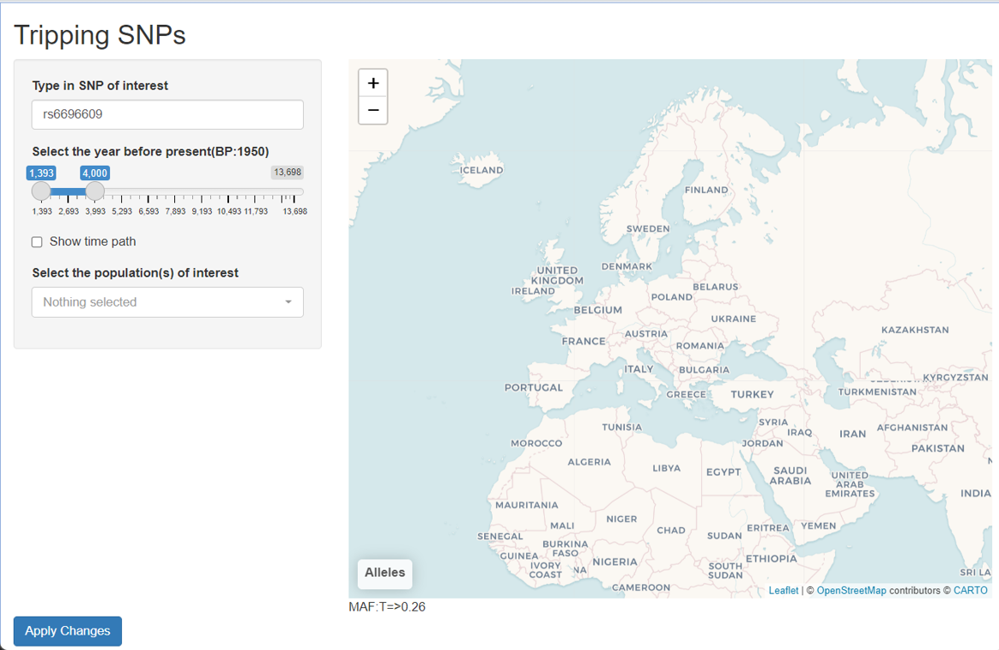
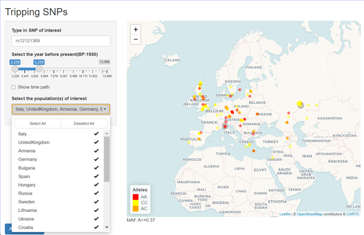
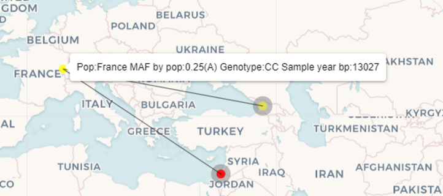

# Tripping_SNPs

Author: Defne Yanartas

Date: March 2023

Sections:
1. Installing and set-up
2. Data
3. Programs (usage)
4. Results

## 1. Installing and set-up
Worked in the penthouse computer for this section.

### PLINK (version v1.07)

Install plink 

```bash
wget https://zzz.bwh.harvard.edu/plink/dist/plink-1.07-x86_64.zip   #download to the bin
unzip plink-1.07-x86_64.zip                                         #after that, add the directory to the path
```
### Git and project directory

Set up the project directory (git repository)
```bash
mkdir Data
mkdir Programs
mkdir Results

gitinit
git remote add origin git@github.com:defneyanartas/Tripping_SNPs.git
git branch -M main
git push --set-upstream origin main 


```

### Conda (version 22.11.1)

conda create --name tripping-r-env r-base 

## 2. Data

It is important to have the directory and file names exactly as stated here. 
```bash
echo "Data/" >> .gitignore                                        #I dont wan to track the Data files, the are large and we dont need them in github.
git add .gitignore
git commit -m "Add Data directory to the ignore file"             #From now on I will not type each time I commit, general procedure is that I commit with every new file/folder/update.
```
Fetch the plink files (fam, bim and bed) from:https://github.com/sarabehnamian/Origins-of-Ancient-Eurasian-Genomes/tree/main/steps/Step%20. Rename the base as Eurasian. Then proceed to use plink to recode the binary files to readable files. Output will be a map and ped file. 
```bash
plink --bfile Eurasian --recode --out Eurasian --noweb
cat Eurasian.map | cut -f 2 | whiel read line; do echo $line > extract.txt; plink --bfile Eurasian --extract extract.txt --recode --out $line --noweb; done
nohup cat to_be_extracted.txt | while read line; do echo $line > extract.txt; plink --bfile Eurasian --extract extract.txt --recode --out $line --noweb ; done &
```
Get the annotation file from course page and name it "Eurasian.anno"

## 3. Programs

### Scripts
Scripts were written in R in RStudio. Below is a session information.

htmlwidgets_1.6.1 compiler_4.2.1    magrittr_2.0.3    fastmap_1.1.0     R6_2.5.1          cli_3.6.0        
leaflet_2.1.1     htmltools_0.5.4   tools_4.2.1       rstudioapi_0.14   crosstalk_1.2.0   digest_0.6.31    
rlang_1.0.6      

### Usage 

We need to run the application in the conda environment that we have created. We also need to install the required packages.
```bash
conda activate tripping-r-env r-base
conda install -c conda-forge r-shiny
conda install -c conda-forge r-tidyverse
conda install -c conda-forge r-leaflet
conda install -c conda-forge r-dplyr
conda install -c conda-forge r-shinywidgets
conda install -c conda-forge r-leaflet.extras
```

You can run the application by running the code below from your project directory. Notice that scripts must be placed under "Programs" directory and the data under "Data" directory.
```
Rscript Programs/Tripping_SNP_shiny.R && R -e "shiny::runApp('Programs/Tripping_SNP_shiny.R', launch.browser = TRUE)"
```
It might take some time to read data depending on the size. When a line like "http://127.0.0.1:4164/" appears, either there will be a popup window on your browser or if not, copy the address to your browser and this should bring up the GUI, then you can select your options and start visualizing.

## 4. Results

The default SNP is depicted together with no populations picked when the application is started. Minor allele and the minor allele frequency (MAF) are also displayed underneath the map for the whole dataset of the chosen SNP.



The user can select a different SNP, certain populations or a time period.



When the user ticks the time path check box, a time tracking line is drawn showing the samples from the oldest to the newest. Also when the cursor is on a marker, information regarding the sample is depicted.

